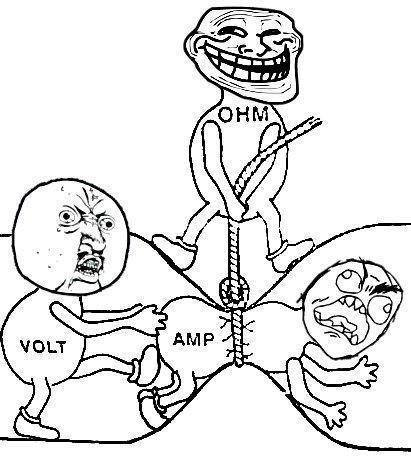

# Aprendendo markdown part1

markdown é uma linguagem que permite escrever textos que depois de salvos apresentam eles em html. 
arquivos markdown tem extensão .md


Este texto direto é um parágrafo. 

Este texto direto é um novo parágrafo. 
Esse texto não é um parágrafo. 

- TÍTULOS TIPO H

# H1
## H2
### H3
#### H4
##### H5

Outra forma de fazer o titulo h1
=

Outra forma de fazer o título h2
-


## Itálico

estava estudando _english_ ontem. 

## Strong/Bold (negrito)

Fiz um curso de **Alemão**

outra forma

__alemão__ é minha segunda lingua. 


## links

[linkedin](https://www.linkedin.com.br)

[linkedin](https://www.linkedin.com.br
"website de curriculum")

<contato@gmail.com>

## citação
> fulano de tal falou isso isso e aquilo 
> continuação da citação com varias linhas. 

## Listas nãao ordenadas 
- manga 
    - espada 
    - verde

* manga 
* uva
    * verde
    * crimson 


## Listas ordenadas 

1. Manga
2. Uva
3. maça
44. Banana


## Lista Ordenada automática

1. manga
  1.1. VERDE
1. Uva
    2.1. argentina

## Imagens locais 



## Imagem WEB

/i257652.jpeg)

## TABELAS
Tabelas por padrão alinham seu conteúdo a esquerda

PRODUTO | PREÇO
------- | ------
playstation 3 | R$ 1900,00
Xbox one | R$ 3000,00
fósforo | R$ 0,30

### alinhamento conteudo de tabelas a direita 

PRODUTO | PREÇO
------- | ------:
playstation 3 | R$ 1900,00
Xbox one | R$ 3000,00
fósforo | R$ 0,30

### alinhamento centralizado 

PRODUTO | PREÇO
:-------: | ------
playstation 3 | R$ 1900,00
Xbox one | R$ 3000,00
fósforo | R$ 0,30

### texto mono-espaçado inline

feito, sem coloração

### python

``` python
import pandas as pd
lista = list[0;1;3;4]
```

### java script

``` js
import pandas as pd
lista = list[0;1;3;4]
```


## Lista de tarefas

- [x] acordar 
- [ ] escovar os dentes
- [ ] ~~tomar café~~

## separar conteúdo

---

# Referências 

[link da foto1][foto1]

[blog algebra][algebralinear]

[foto1]: foto.jpg
[algebralinear]: https://www.ime.unicamp.br/~marcia/AlgebraLinear/index.html

